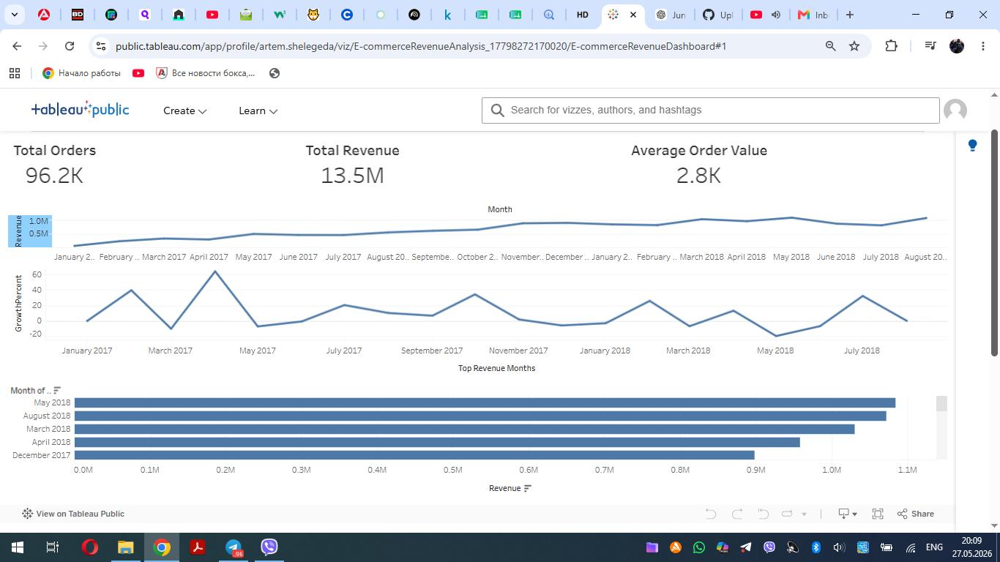

# E-commerce Revenue Analysis

## Project Overview

This project analyzes e-commerce sales performance using SQL and Tableau.

The dashboard focuses on:

- Revenue trends
- Order analysis
- Average Order Value (AOV)
- Monthly growth analysis
- Top revenue months

---

## Tools Used

- SQL (BigQuery)
- Tableau Public
- GitHub

---

## Key KPIs

- Total Revenue: 13.5M
- Total Orders: 96.2K
- Average Order Value: 2.8K

---

## Dashboard Features

- Revenue Trend Analysis
- Monthly Growth %
- Top Revenue Months
- KPI Overview

---

## Tableau Dashboard

https://public.tableau.com/views/E-commerceRevenueAnalysis_17798272170020/E-commerceRevenueDashboard?:language=en-US&publish=yes&:display_count=n&:origin=viz_share_link
## Dashboard Preview

